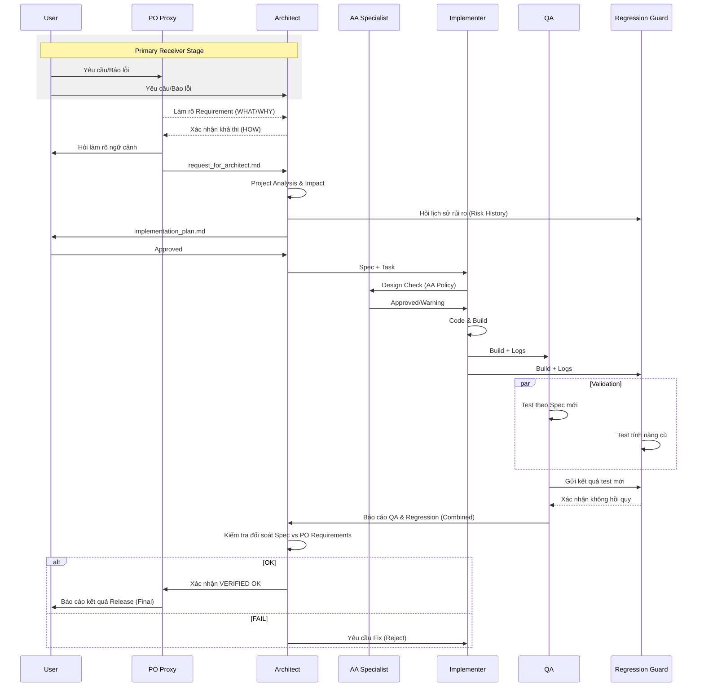

# Quy trình phối hợp (Agent Cooperation Workflow)

Workflow Tổng thể
1. User → PO Proxy  
2. PO → Architect (Spec)  
3. Architect → Implementer  
4. ➤ BUILD GATE  
5. Implementer → QA  
6. QA → Architect  
7. Architect → User

---

## 0. Nguyên tắc nền tảng

* Service là Single Source of Truth (SSoT).
* JavaScript chỉ đóng vai trò Telemetry – tuyệt đối không side-effect.
* Implementer KHÔNG được tự ý thay đổi nghiệp vụ.
* QA là Quality Gatekeeper, mọi bản build phải được QA chấp thuận.
* Architect là đầu mối báo cáo duy nhất với User.

---

## 1. Giai đoạn Phân tích Yêu cầu (PO Proxy chủ trì)

**Mục tiêu**: Chuyển đổi ngôn ngữ User → Requirement rõ ràng.

**Hoạt động**:

1. Tiếp nhận yêu cầu/báo lỗi từ User.
2. Viết User Story & Acceptance Criteria.
3. Làm rõ môi trường: xe thật/giả lập, tần suất, bước tái hiện.

**Output**: `request_for_architect.md`.

---

## 2. Giai đoạn Lập kế hoạch (Architect chủ trì)

**Input**: `request_for_architect.md`.

**CRITICAL GATE – BẮT BUỘC có**:

1. Requirement ID.
2. Test Cases chi tiết.
3. Rollback Plan.
4. Impact Analysis.
5. State Machine Reference.
6. Log Contract.

**Output**: `implementation_plan.md` được User phê duyệt.

---

## 3. Giai đoạn Triển khai (Implementer)

**Ràng buộc**:

* Chỉ code theo Spec.
* Không tự mute trong JS.
* Không thao túng MediaSession ngoài Service.
* Không đổi flow nghiệp vụ Ad.

**Điều kiện bàn giao**:

* Build thành công trên tất cả môi trường quy định.
* Không còn lỗi biên dịch/Gradle.
* Cung cấp:

  * Code
  * Log mẫu
  * Map: Code → Rule → Test.

**Luồng bàn giao**: Implementer → QA & Regression Guard (không gửi User).

---

## 3B. Build Escalation Rule

Nếu Implementer:

* Build lỗi ≥ 30 lần, hoặc
* Một nhóm lỗi lặp lại ≥ 10 lần

→ BẮT BUỘC kích hoạt Escalation:

1. Implementer tạo `build_failure_report.md`.
2. Gửi Architect + QA.
3. Architect phải:

   * Review lại kiến trúc
   * Kiểm tra tính khả thi của Spec
   * Quyết định:

     * điều chỉnh thiết kế,
     * tạo REQ-ID mới,
     * hoặc đổi hướng tiếp cận.

QA giám sát – Implementer KHÔNG được tự sửa kiến trúc.

---

## 4. Giai đoạn Xác thực (QA & Regression Guard)

### QA – Kiểm thử tính năng mới

**MANDATORY TEST**:

1. Android Auto Focus Matrix.
2. Ad flow (Skip/Mute/Resume).
3. Offline/Buffering/Sleep.
4. Metadata & State Machine.

### Regression Guard – Bảo vệ tính năng cũ

**Checklist bất biến**:

1. Touch control của AABrowser cũ.
2. Khởi động trên CMU.
3. USB Reconnect.
4. Media Control cơ bản.

**Decision Gate**:

* PASS: cả QA và RG đồng ý.
* BLOCK: chỉ cần 1 bên từ chối → CẤM MERGE.

---

## 5. Fast Rollback Trigger

Kích hoạt rollback khi:

* Bug rate > 5%.
* Mất Audio Focus > 1 lần/10 phút.
* Mute nhầm content.
* Regression Guard báo động đỏ.

**Người quyết định**: Architect (tham vấn QA + RG, trình User phê duyệt).

---

## 6. Definition of Done

* 100% Test Case PASS.
* Không ô trắng State Matrix.
* Có Evidence Logs đầy đủ.
* Không regression AABrowser.
* PO Proxy xác nhận đúng yêu cầu User.

---

## 7. Reporting Chain (BẮT BUỘC)

1. QA → báo cáo cho Architect.
2. Regression Guard → báo cáo cho Architect.
3. Architect:

   * đối chiếu Spec vs Requirement,
   * tổng hợp Risk,
   * là người DUY NHẤT gửi báo cáo cho User.

**QA KHÔNG BAO GIỜ báo trực tiếp cho User.**

---

Tài liệu này áp dụng chung cho mọi dự án đa‑agent và chỉ được sửa đổi bởi Architect với sự phê duyệt của User.